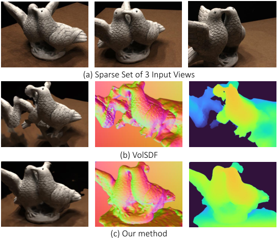

# S-VolSDF
This is the official implementation of **S-VolSDF: Sparse Multi-View Stereo Regularization of Neural Implicit Surfaces**.

[Haoyu Wu](https://hao-yu-wu.github.io/),
[Alexandros Graikos](https://alexgraikos.github.io/),
[Dimitris Samaras](https://www3.cs.stonybrook.edu/~samaras/)

International Conference on Computer Vision (ICCV), 2023

### [Project page](https://hao-yu-wu.github.io/s-volsdf/) | [Paper](https://arxiv.org/abs/2303.17712/)



--------------------------------------

## Installation
The code is compatible with python 3.6, CUDA 11.1, and pytorch 1.9.0.

```bash
conda create --name s_volsdf python=3.6
conda activate s_volsdf
pip install -r requirements.txt
```

--------------------------------------

## Data
Download [data_s_volsdf](https://drive.google.com/drive/folders/17id41OjHg6VEdEgfJtCmCxbBbsVnk6fy), inlcuding the DTU and the BlendedMVS Dataset. Then,

```bash
unzip data_s_volsdf.zip -d ./
```

--------------------------------------

## Train

```bash
# DTU
python runner.py testlist=scan106 outdir=exps_mvs exps_folder=exps_vsdf opt_stepNs=[100000,0,0]
# BlendedMVS (BMVS)
python runner.py vol=bmvs testlist=scan4 outdir=exps_mvs exps_folder=exps_vsdf opt_stepNs=[100000,0,0]
```
- Train all scans sequentially: ```testlist='config/lists/dtu.txt'``` or ```testlist='config/lists/bmvs.txt'```
- Check more details in ```./config```

--------------------------------------

## Eval - 3D Reconstruction
```bash
# DTU  
python evals/eval_dtu.py --datadir exps_mvs --scan 106 --data_dir_root data_s_volsdf
# BlendedMVS (BMVS) 
python evals/eval_bmvs.py --datadir exps_mvs --scan 4 --data_dir_root data_s_volsdf
```
- Evaluate all scans: ```--scan -1```
- The metric is the Chamfer distance (in mm) of the output point clouds .

## Eval - Novel View Synthesis
1. Render and save RGBD
```bash
# DTU
python eval_vsdf.py --conf dtu --eval_rendering --data_dir_root data_s_volsdf --expname ours --exps_folder exps_vsdf --evals_folder exps_result 
# BMVS: --conf bmvs
```

2. Simple image-based rendering
```bash
# prepare data
python runner.py +create_scene=true outdir=exps_ibr testlist='config/lists/dtu.txt' # DTU
python runner.py vol=bmvs +create_scene=true outdir=exps_ibr testlist='config/lists/bmvs.txt' # BMVS

# image-based rendering
python simple_ibr.py outdir=exps_ibr +evals_folder=exps_result testlist='config/lists/dtu.txt' # DTU
python simple_ibr.py vol=bmvs outdir=exps_ibr +evals_folder=exps_result testlist='config/lists/bmvs.txt' # BMVS
```

3. Evaluate
```bash
# DTU
python eval_vsdf.py --conf dtu --data_dir_root data_s_volsdf --eval_rendering --expname ours --exps_folder exps_vsdf --evals_folder exps_result --result_from blend
# BMVS: --conf bmvs
```

--------------------------------------

## Acknowledgements

- This work was supported in part by the NASA Biodiversity Program (Award 80NSSC21K1027), and NSF Grant IIS-2212046.
- We also thank Alfredo Rivero for his thoughtful feedback and meticulous proofreading.
- We borrowed code from [VolSDF](https://github.com/lioryariv/volsdf), [CasMVSNet](https://github.com/alibaba/cascade-stereo/tree/master/CasMVSNet), [UCSNet](https://github.com/touristCheng/UCSNet), [TransMVSNet](https://github.com/megvii-research/TransMVSNet), and [DTUeval-python](https://github.com/jzhangbs/DTUeval-python). We thank all the authors for their great work and repos.

--------------------------------------

## Citation
If you find our code useful for your research, please cite
```
@article{wu2023s,
  title={S-VolSDF: Sparse Multi-View Stereo Regularization of Neural Implicit Surfaces},
  author={Wu, Haoyu and Graikos, Alexandros and Samaras, Dimitris},
  journal={arXiv preprint arXiv:2303.17712},
  year={2023}
}
```
